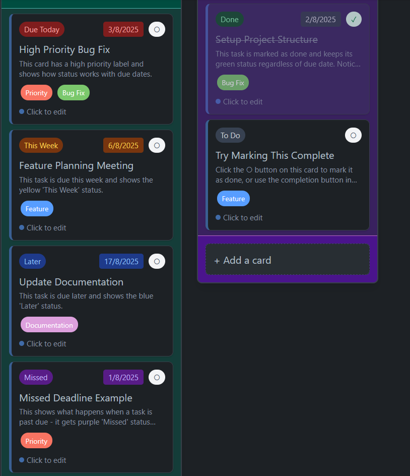
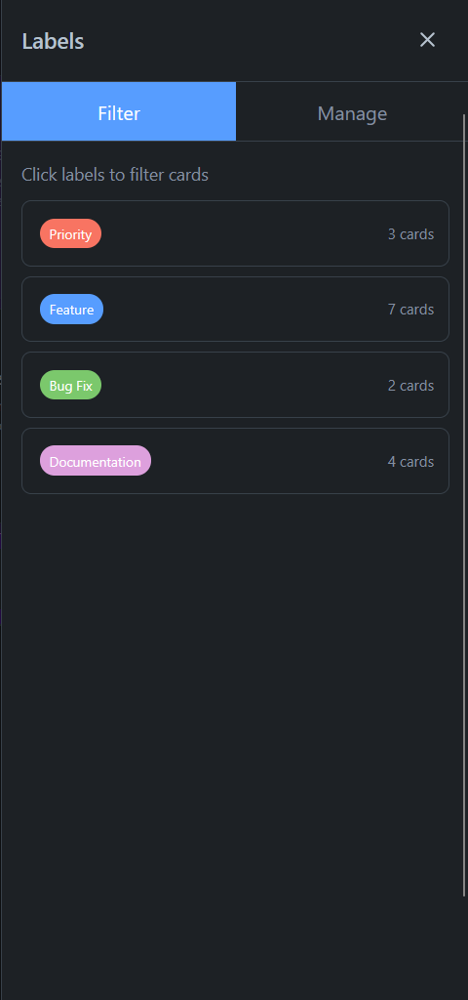
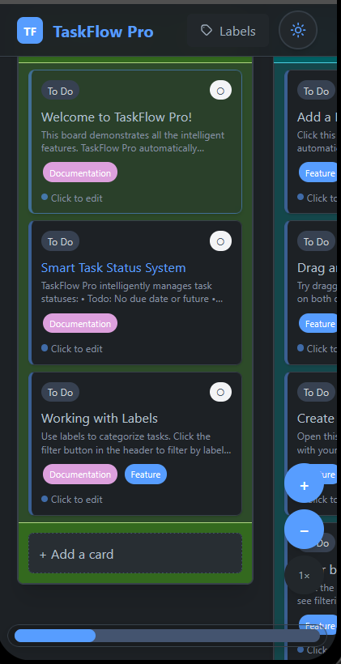
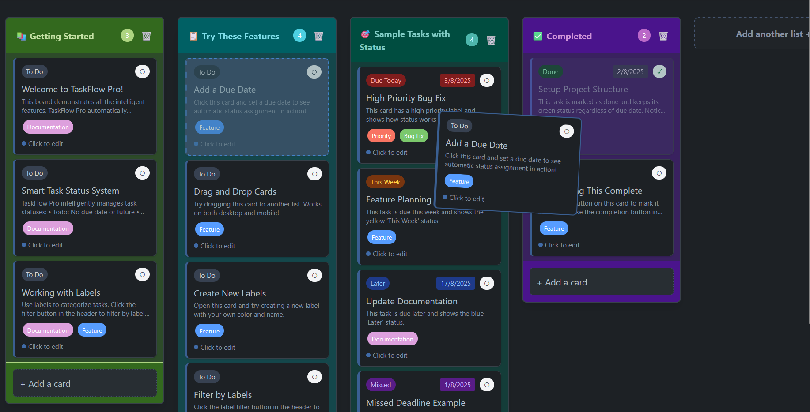

# 🚀 TaskFlow Pro

**Intelligent Kanban boards with smart task status management**

TaskFlow Pro goes beyond traditional kanban tools by automatically managing task statuses based on due dates while preserving your manual completions. Built with modern React and featuring a mobile-first design.

*Inspired by [Trello](https://trello.com) with enhanced intelligent features.*

[🌟 **LIVE DEMO**](https://taskflow-pro-ayush.vercel.app/)

## ✨ Key Features

### 🎯 Smart Task Management
- **🤖 Automatic Status Calculation**: Tasks automatically get status badges (Due Today, This Week, Later, Missed)
- **✅ Manual Completion Override**: Mark tasks as "Done" and they stay completed regardless of due date
- **🎨 Visual Status Indicators**: Color-coded status system with professional design
- **📅 Due Date Intelligence**: Smart categorization based on time remaining

### 🎨 Professional Design
- **🌓 Dark/Light Themes**: Automatic theme switching with CSS variables
- **📱 Mobile-Optimized**: Touch-friendly drag & drop with zoom controls and floating scrollbar
- **✨ Smooth Interactions**: Custom scrollbars and polished animations
- **🎯 Responsive Design**: Works seamlessly across all devices

### 🏗️ Advanced Features
- **🏷️ Smart Label Filtering**: OR logic across multiple labels with persistent state
- **🎯 Drag & Drop Excellence**: Powered by @dnd-kit with better UX than competitors
- **💾 Local Storage**: Automatic data persistence across browser sessions
- **🔍 Visual Filter Indicators**: Active filter count with quick access

## 🏆 Why Choose TaskFlow Pro?

Unlike basic kanban tools, TaskFlow Pro intelligently manages your workflow:
- **🧠 Smarter than Trello**: Automatic task prioritization based on due dates
- **📱 Better Mobile Experience**: Superior touch interactions and zoom controls
- **🏗️ Professional Architecture**: Enterprise-grade React patterns and performance
- **🎨 Modern Design**: Clean interface that adapts to your preferences

## 🛠️ Tech Stack

- **React 18** - UI Framework with modern hooks and concurrent features
- **@dnd-kit** - Modern, accessible drag and drop functionality
- **Tailwind CSS v4** - Next-gen styling with CSS variables for dynamic theming
- **Vite** - Lightning-fast development and build tooling
- **Handler-Hook-Context Pattern** - Sophisticated state management architecture
- **UUID** - Unique ID generation for data integrity

## 🚀 Quick Start

```bash
# Clone the repository
git clone https://github.com/Ayush-Tak/taskflow-pro.git
cd taskflow-pro

# Install dependencies
npm install

# Start development server
npm run dev

# Open http://localhost:5173
```

## � How to Use

### Smart Task Management
- **Add Due Dates**: Set due dates in card modal to enable smart status tracking
- **Manual Completion**: Click "Done" to complete tasks (overrides auto-status)
- **Visual Status Badges**: Color-coded status shows task urgency at a glance

### Lists & Cards
- **Add List**: Click "Add another list +" button
- **Edit List**: Double-click on any list title
- **Add Card**: Click "+ Add a card" in any list
- **Edit Card**: Click on any card to open edit modal
- **Drag & Drop**: Drag cards between lists or reorder within lists

### Labels & Filtering
- **Manage Labels**: Click "Labels" button in header
- **Create Labels**: Choose from 12 professional colors
- **Filter Board**: Select multiple labels to show relevant cards
- **Smart Filtering**: Uses OR logic (shows cards with ANY selected label)

### Themes
- **Toggle Theme**: Click sun/moon icon to switch between light/dark
- **Auto-Detection**: Respects your system theme preference
- **Persistent**: Your theme choice is saved across sessions

## 📱 Screenshots

### Smart Task Status System

*Automatic status badges: Due Today (red), This Week (yellow), Later (blue), Done (green)*

### Advanced Label System & Filtering

*Professional 12-color label palette with smart filtering capabilities*

### Mobile-Optimized Experience

*Touch-friendly drag & drop, zoom controls, and floating scrollbar*

### Dark Theme

*Professional dark mode with optimized contrast and modern design*

### Drag & Drop with Visual Feedback

*Smooth drag operations with visual overlays and touch optimization*

## 🎯 Core Features Comparison

| Feature | TaskFlow Pro | Traditional Kanban |
|---------|-------------|-------------------|
| Task Status | 🤖 Automatic + Manual | ⚠️ Manual Only |
| Mobile Experience | 📱 Optimized with zoom controls | 📱 Basic responsive |
| Theme System | 🎨 CSS Variables with auto-detection | 🎨 Limited options |
| Label Filtering | 🔍 Smart OR logic with multiple labels | 🔍 Basic single filters |
| Performance | ⚡ Modern React 18 with code splitting | 🐌 Legacy patterns |

## 🎯 Deployment

This app is optimized for Vercel deployment:

1. **Connect Repository**: Link your GitHub repo to Vercel
2. **Auto-Deploy**: Pushes to main branch trigger automatic deployments
3. **Zero Config**: No additional setup needed - Vercel detects React/Vite automatically

## 🤝 Contributing

We welcome contributions! Please follow these guidelines:

1. **Fork the repository**
2. **Create a feature branch** (`git checkout -b feature/amazing-feature`)
3. **Follow the handler-hook-context pattern** for consistency
4. **Commit changes** (`git commit -m 'Add amazing feature'`)
5. **Push to branch** (`git push origin feature/amazing-feature`)
6. **Open a Pull Request** with detailed description


## 🙏 Acknowledgments

- **Inspired by**: [Trello](https://trello.com) - The original kanban board that started it all
- **Built with**: [Vite](https://vitejs.dev), [React 18](https://reactjs.org), [@dnd-kit](https://dndkit.com)
- **Performance**: Optimized for modern browsers and mobile devices

---

<div align="center">

**[🌟 Try TaskFlow Pro Live](https://taskflow-pro-ayush.vercel.app) | [📚 Documentation](README.md) | [🐛 Report Issues](https://github.com/Ayush-Tak/taskflow-pro/issues)**

*Built with ❤️ by [Ayush-Tak](https://github.com/Ayush-Tak)*
