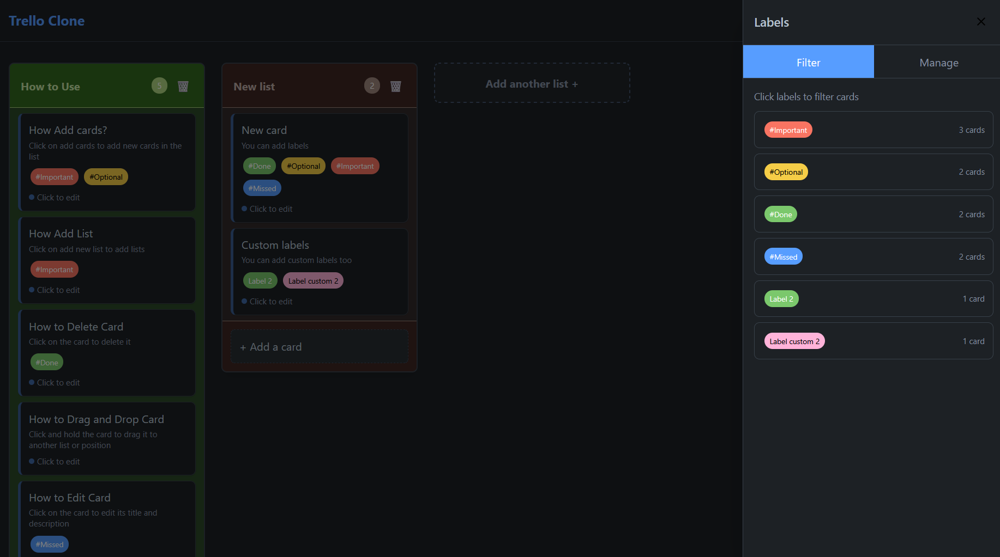

# 🚀 Trello Clone

A modern, feature-rich Trello clone built with React and featuring drag-and-drop functionality, labels system, filtering, theme switching, and beautiful randomized list colors.
[LIVE DEMO](https://trello-clone-five-peach.vercel.app/)

## ✨ Features

### 🔥 Core Functionality
- **📝 Lists Management**: Create, edit, and delete lists with double-click editing
- **🎴 Cards Management**: Add, edit, and delete cards with detailed descriptions
- **🎯 Drag & Drop**: Seamless drag-and-drop for both cards and lists using @dnd-kit
- **💾 Local Storage**: Automatic data persistence across browser sessions

### 🏷️ **NEW: Labels System**
- **12 Color Label Palette**: Professional color scheme with theme adaptation
- **Label Management**: Create, edit, and delete labels via dedicated sidebar
- **Card Label Assignment**: Add/remove labels directly from card modal or create new ones on-the-fly
- **Smart Filtering**: Filter board by multiple labels with OR logic (shows cards with ANY selected label)
- **Visual Filter Indicators**: Active filter count displayed in header with quick access
- **Theme-Adaptive Colors**: Labels automatically adjust brightness for light/dark themes

### 🎨 Design & UX
- **🌓 Dark/Light Theme**: Toggle between themes with smooth transitions
- **🌈 Randomized List Colors**: Each list gets a unique, professional color scheme
- **📱 Responsive Design**: Works beautifully on desktop and mobile devices
- **✨ Smooth Animations**: Polished hover effects and transitions
- **🎯 Improved Navigation**: Fixed header with enhanced visibility and backdrop blur

### 🎭 Advanced Theme System
- **Professional Color Palette**: Carefully chosen colors for optimal readability
- **CSS Variables with Tailwind v4**: Dynamic theming with custom properties
- **System Theme Detection**: Respects user's system preferences
- **Theme Persistence**: Remembers your theme choice
- **Label Color Optimization**: Darker colors for light theme, brighter for dark theme

## 🛠️ Built With

- **React 18** - UI Framework with latest hooks and concurrent features
- **@dnd-kit** - Modern, accessible drag and drop functionality
- **Tailwind CSS v4** - Next-gen styling with CSS variables for theming
- **Vite** - Lightning-fast development and build tooling
- **Context API + useReducer** - Sophisticated state management pattern
- **UUID** - Unique ID generation
- **LocalStorage** - Data persistence with error handling

## 🚀 Getting Started

### Prerequisites
- Node.js (v18 or higher)
- npm or yarn

### Installation

1. **Clone the repository**
```bash
git clone https://github.com/Ayush-Tak/trello-clone.git
cd trello-clone
```

2. **Install dependencies**
```bash
npm install
# or
yarn install
```

3. **Start the development server**
```bash
npm run dev
# or
yarn dev
```

4. **Open your browser**
Navigate to `http://localhost:5173`

## 🎮 How to Use

### Managing Lists
- **Add List**: Click "Add another list +" button
- **Edit List**: Double-click on any list title
- **Delete List**: Click the 🗑️ button (confirms before deletion)
- **Drag Lists**: Click and drag list headers to reorder

### Managing Cards
- **Add Card**: Click "+ Add a card" in any list
- **Edit Card**: Click on any card to open the edit modal
- **Delete Card**: Click "Delete" button in the card modal
- **Drag Cards**: Click and drag cards between lists or reorder within a list

### **NEW: Labels & Filtering**
- **Access Labels**: Click "Labels" button in the header
- **Create Labels**: Use "Manage" tab in Labels sidebar, choose from 12 colors
- **Assign to Cards**: Add labels via card modal or create new ones instantly
- **Filter Board**: Use "Filter" tab to show only cards with selected labels
- **Multiple Filters**: Select multiple labels to show cards with ANY of those labels
- **Quick Filter Management**: Active filter count shown in header for easy access

### Theme Switching
- **Toggle Theme**: Click the sun/moon icon in the top-right corner
- **System Theme**: Automatically detects your system preference
- **Persistent**: Your theme choice is saved between sessions

## 🎨 Advanced Color System

The app features a sophisticated color system with:
- **12 Professional Color Schemes**: Each list gets a unique color combination
- **12 Label Colors**: Distinct label palette with semantic naming (blue, green, yellow, etc.)
- **Light/Dark Variants**: Every color has optimized light and dark theme versions
- **Consistent Randomization**: Same list always gets the same color (based on ID hash)
- **Theme-Adaptive Labels**: Labels automatically adjust for optimal contrast
- **Accessibility**: All colors meet WCAG contrast requirements

## 📁 Project Structure

```
src/
├── components/
│   ├── Board.jsx             # Main board with DndContext and fixed header
│   ├── List.jsx              # List component with drag-drop
│   ├── Card.jsx              # Card component with modal and label support
│   ├── Label.jsx             # Individual label component
│   ├── LabelSidebar.jsx      # Label management sidebar (Filter/Manage tabs)
│   └── ThemeToggleButton.jsx # Theme switcher
├── contexts/
│   ├── BoardContext.jsx      # Global state with labels integration
│   └── ThemeContext.jsx      # Theme state management
├── handlers/
│   ├── boardHandlers.js      # Board operations factory
│   ├── cardHandlers.js       # Card CRUD operations
│   ├── labelHandlers.js      # Label management operations
│   └── boardDNDHandlers.js   # Drag-and-drop business logic
├── hooks/
│   ├── useBoardDragAndDrop.js # Main DND hook
│   ├── useListDragAndDrop.js  # List drag handling
│   └── useCardDragAndDrop.js  # Card drag handling
├── utils/
│   └── listColors.js         # Color scheme utilities
├── index.css                 # Global styles & CSS variables with label colors
├── App.jsx                   # Root component with provider hierarchy
└── main.jsx                  # Entry point
```

## 🔧 Technical Features

### Advanced State Management
- **Handler-Hook-Context Pattern**: Clean separation of concerns
- **React Context**: Global state for boards, labels, and theme
- **useReducer**: Complex state logic for board operations including labels
- **Factory Pattern**: Handler functions with proper closure over dispatch
- **Local Storage**: Automatic persistence with error handling

### Sophisticated Drag & Drop
- **@dnd-kit**: Modern, accessible drag-and-drop
- **Multi-type Dragging**: Support for both cards and lists
- **Visual Feedback**: Drag overlays and hover states with enhanced animations
- **Touch Support**: Works perfectly on mobile devices
- **Label-Aware Filtering**: Drag operations work seamlessly with active filters

### Modern Styling Architecture
- **Tailwind CSS v4**: Latest utility-first CSS framework
- **CSS Variables**: Dynamic theming system with automatic theme switching
- **Label Utility Classes**: Pre-compiled label colors for reliable rendering
- **Responsive Design**: Mobile-first approach with desktop optimization
- **Glass Morphism**: Modern backdrop blur effects and transparency
- **Custom Animations**: Smooth transitions and hover effects

### Labels System Architecture
- **OR Logic Filtering**: Shows cards containing ANY of the selected labels
- **Real-time Updates**: Instant visual feedback for filter changes
- **Persistent Filters**: Filter state maintained during board operations
- **Color Picker**: Intuitive selection with checkmarks and borders
- **Theme Integration**: Seamless label color adaptation for light/dark themes

## 🎯 Recent Enhancements & Future Features

### ✅ Recently Added
- [x] **Complete Labels System**: Full CRUD operations with filtering
- [x] **Advanced Color Picker**: 12-color palette with theme adaptation
- [x] **Smart Filtering**: Multi-label OR logic with visual indicators
- [x] **Enhanced Navigation**: Fixed header with improved visibility
- [x] **Theme-Aware Labels**: Automatic color optimization for light/dark themes

### 🔜 Planned Features
- [ ] Card due dates with calendar integration
- [ ] Search functionality across cards and labels
- [ ] Card checklists with progress indicators
- [ ] File attachments and image previews
- [ ] Multiple boards with board switching
- [ ] Export/import functionality (JSON/CSV)
- [ ] Keyboard shortcuts for power users
- [ ] Card templates and quick actions

## 📸 Screenshots

### Light Theme with Labels


### Dark Theme with Filtering


### Labels Management Sidebar


### Drag & Drop with Labels


## 🤝 Contributing

1. Fork the repository
2. Create a feature branch (`git checkout -b feature/amazing-feature`)
3. Follow the established **handler-hook-context** pattern
4. Commit your changes (`git commit -m 'Add amazing feature'`)
5. Push to the branch (`git push origin feature/amazing-feature`)
6. Open a Pull Request

## 🙏 Acknowledgments

- Inspired by [Trello](https://trello.com)
- Built with [Vite](https://vitejs.dev)
- Modern drag & drop by [@dnd-kit](https://dndkit.com)
- Icons by [Heroicons](https://heroicons.com)
- App icon by [Freepik](https://www.flaticon.com/authors/freepik) from [Flaticon](https://www.flaticon.com/)

---

**Made with ❤️ by Ayush-Tak**