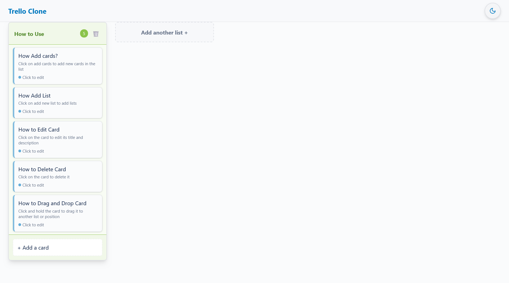
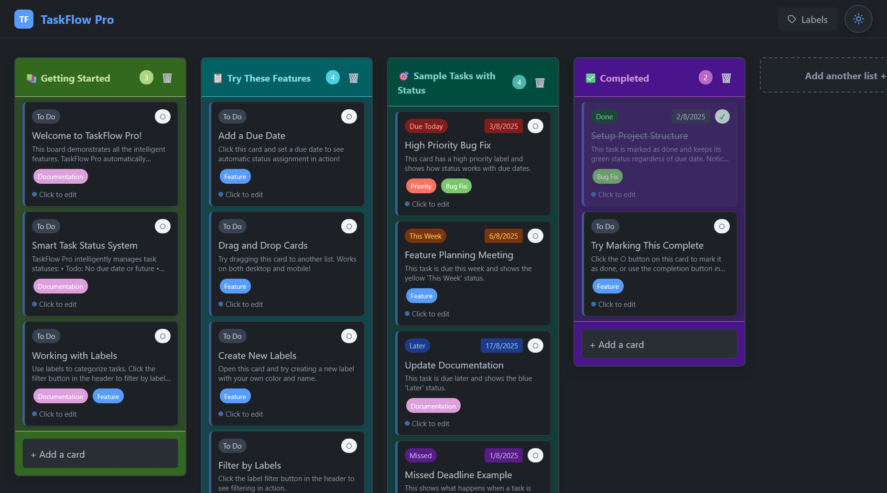
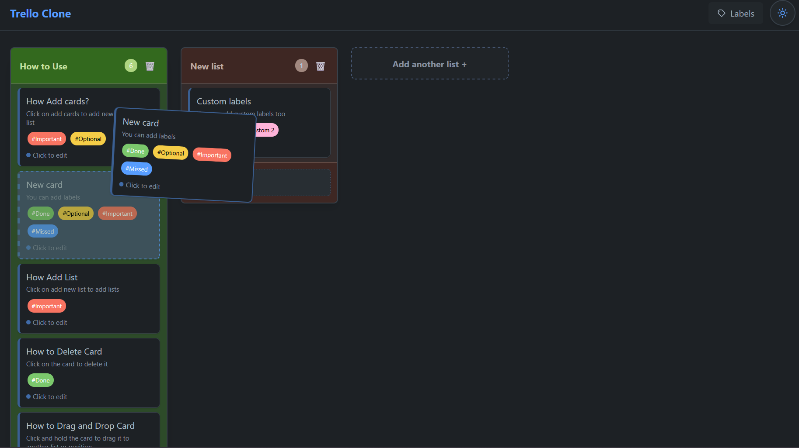

# 🚀 TaskFlow Pro- **🎨 Visual St### 🎨 Design & ### 🏷️ Smart Labels SystemX
## 🏆 Why Choose TaskFlow Pro?us Indicators**: Color-coded status system with professional design
- **📅 Due Date Intelligence**: Smart categorization based on time remaining

### 🎨 Professional Design**Intelligent Kanban boards with smart task status management**

TaskFlow Pro goes beyond traditional kanban tools by automatically managing task statuses based on due dates while preserving your manual completions. Built with ## 📄 License

MIT License - feel free to use for personal or commercial projects.

## 🙏 Acknowledgmentsn React and featuring a mobile-first design.

[🌟 **LIVE DEMO**](https://taskflow-pro.vercel.app/)

## ✨ Key Features

### 🎯 Smart Task Management
- **🤖 Automatic Status Calculation**: Tasks automatically get status badges (Due Today, This Week, Later, Missed)
- **✅ Manual Completion Override**: Mark tasks as "Done" and they stay completed regardless of due date
- **� Visual Status Indicators**: Color-coded status system with professional design
- **� Due Date Intelligence**: Smart categorization based on time remaining

### � Professional Design
- **🌓 Dark/Light Themes**: Automatic theme switching with CSS variables
- **📱 Mobile-Optimized**: Touch-friendly drag & drop with zoom controls and floating scrollbar
- **✨ Smooth Interactions**: Custom scrollbars and polished animations
- **🎯 Responsive Design**: Works seamlessly across all devices

### 🏗️ Advanced Features
- **🏷️ Smart Label Filtering**: OR logic across multiple labels with persistent state
- **🎯 Drag & Drop Excellence**: Powered by @dnd-kit with better UX than competitors
- **💾 Local Storage**: Automatic data persistence across browser sessions
- **🔍 Visual Filter Indicators**: Active filter count with quick access

### 🎨 Design & UX
## � Why Choose TaskFlow Pro?

Unlike basic kanban tools, TaskFlow Pro intelligently manages your workflow:
- **🧠 Smarter than Trello**: Automatic task prioritization based on due dates
- **📱 Better Mobile Experience**: Superior touch interactions and zoom controls
- **🏗️ Professional Architecture**: Enterprise-grade React patterns and performance
- **🎨 Modern Design**: Clean interface that adapts to your preferences

### 🔥 Core Functionality
- **📝 Lists Management**: Create, edit, and delete lists with double-click editing
- **🎴 Cards Management**: Add, edit, and delete cards with detailed descriptions
- **🎯 Drag & Drop Excellence**: Seamless drag-and-drop for both cards and lists using @dnd-kit
- **💾 Data Persistence**: Automatic local storage with error handling

### �️ Smart Labels System
- **12 Color Label Palette**: Professional color scheme with theme adaptation
- **Label Management**: Create, edit, and delete labels via dedicated sidebar
- **Card Label Assignment**: Add/remove labels directly from card modal
- **Advanced Filtering**: Filter board by multiple labels with OR logic
- **Theme-Adaptive Colors**: Labels automatically adjust for optimal contrast

## 🛠️ Tech Stack

- **React 18** - UI Framework with modern hooks and concurrent features
- **@dnd-kit** - Modern, accessible drag and drop functionality
- **Tailwind CSS v4** - Next-gen styling with CSS variables for dynamic theming
- **Vite** - Lightning-fast development and build tooling
- **Handler-Hook-Context Pattern** - Sophisticated state management architecture
- **UUID** - Unique ID generation for data integrity

## 🚀 Quick Start

### Prerequisites
- Node.js (v18 or higher)
- npm or yarn

### Installation

1. **Clone the repository**
```bash
git clone https://github.com/Ayush-Tak/taskflow-pro.git
cd taskflow-pro
```

2. **Install dependencies**
```bash
npm install
```

3. **Start the development server**
```bash
npm run dev
```

4. **Open your browser**
Navigate to `http://localhost:5173`

## 🎮 How to Use TaskFlow Pro

### Smart Task Management
- **Auto Status Calculation**: Tasks automatically get status badges based on due dates
- **Manual Completion**: Click "Done" to manually complete tasks (overrides auto-status)
- **Due Date Setting**: Add due dates in card modal to enable smart status tracking
- **Visual Indicators**: Color-coded status badges show task urgency at a glance

### Managing Lists
- **Add List**: Click "Add another list +" button
- **Edit List**: Double-click on any list title
- **Delete List**: Click the 🗑️ button (confirms before deletion)
- **Drag Lists**: Click and drag list headers to reorder

### Managing Cards
- **Add Card**: Click "+ Add a card" in any list
- **Edit Card**: Click on any card to open the edit modal
- **Delete Card**: Click "Delete" button in the card modal
- **Drag Cards**: Click and drag cards between lists or reorder within a list

### **NEW: Labels & Filtering**
- **Access Labels**: Click "Labels" button in the header
- **Create Labels**: Use "Manage" tab in Labels sidebar, choose from 12 colors
- **Assign to Cards**: Add labels via card modal or create new ones instantly
- **Filter Board**: Use "Filter" tab to show only cards with selected labels
- **Multiple Filters**: Select multiple labels to show cards with ANY of those labels
- **Quick Filter Management**: Active filter count shown in header for easy access

### Theme Switching
- **Toggle Theme**: Click the sun/moon icon in the top-right corner
- **System Theme**: Automatically detects your system preference
- **Persistent**: Your theme choice is saved between sessions

## 🎨 Advanced Color System

The app features a sophisticated color system with:
- **12 Professional Color Schemes**: Each list gets a unique color combination
- **12 Label Colors**: Distinct label palette with semantic naming (blue, green, yellow, etc.)
- **Light/Dark Variants**: Every color has optimized light and dark theme versions
- **Consistent Randomization**: Same list always gets the same color (based on ID hash)
- **Theme-Adaptive Labels**: Labels automatically adjust for optimal contrast
- **Accessibility**: All colors meet WCAG contrast requirements

## 📁 Project Structure

```
src/
├── components/
│   ├── Board.jsx             # Main board with DndContext and fixed header
│   ├── List.jsx              # List component with drag-drop
│   ├── Card.jsx              # Card component with modal and label support
│   ├── Label.jsx             # Individual label component
│   ├── LabelSidebar.jsx      # Label management sidebar (Filter/Manage tabs)
│   └── ThemeToggleButton.jsx # Theme switcher
├── contexts/
│   ├── BoardContext.jsx      # Global state with labels integration
│   └── ThemeContext.jsx      # Theme state management
├── handlers/
│   ├── boardHandlers.js      # Board operations factory
│   ├── cardHandlers.js       # Card CRUD operations
│   ├── labelHandlers.js      # Label management operations
│   └── boardDNDHandlers.js   # Drag-and-drop business logic
├── hooks/
│   ├── useBoardDragAndDrop.js # Main DND hook
│   ├── useListDragAndDrop.js  # List drag handling
│   └── useCardDragAndDrop.js  # Card drag handling
├── utils/
│   └── listColors.js         # Color scheme utilities
├── index.css                 # Global styles & CSS variables with label colors
├── App.jsx                   # Root component with provider hierarchy
└── main.jsx                  # Entry point
```

## 🔧 Technical Features

### Advanced State Management
- **Handler-Hook-Context Pattern**: Clean separation of concerns
- **React Context**: Global state for boards, labels, and theme
- **useReducer**: Complex state logic for board operations including labels
- **Factory Pattern**: Handler functions with proper closure over dispatch
- **Local Storage**: Automatic persistence with error handling

### Sophisticated Drag & Drop
## 🏗️ Architecture Highlights

### Handler-Hook-Context Pattern
- **Centralized State Management**: Single source of truth with useReducer
- **Factory Pattern Handlers**: Reusable event handlers with proper closure
- **Custom Hooks**: Encapsulated drag-and-drop and business logic
- **Type Safety**: Consistent action patterns and state validation

### Smart Task Status System
- **Automatic Calculation**: Date-based status determination with manual override
- **Visual Design System**: Color-coded badges with professional styling
- **Real-time Updates**: Status calculation on due date changes
- **Persistence**: Manual completion status maintained across sessions

### Advanced Drag & Drop
- **@dnd-kit Integration**: Modern, accessible drag-and-drop
- **Multi-type Dragging**: Support for both cards and lists
- **Visual Feedback**: Drag overlays and touch-optimized interactions
- **Mobile Excellence**: Zoom controls and floating scrollbars

### Professional Theme System
- **CSS Variables**: Dynamic theming with automatic mode switching
- **Mobile-First Design**: Touch-friendly with responsive breakpoints
- **Performance Optimized**: Efficient re-renders and state management
- **Accessibility**: ARIA labels and keyboard navigation support

## 🎯 Deployment & Production

### Vercel Deployment
This app is optimized for Vercel deployment with automatic builds from GitHub:

1. **Connect Repository**: Link your GitHub repo to Vercel
2. **Auto-Deploy**: Pushes to main branch trigger automatic deployments
3. **Environment Variables**: No additional config needed for this project
4. **Custom Domain**: Easy custom domain setup through Vercel dashboard

### Performance Features
- **Automatic Code Splitting**: Optimized bundle sizes with Vite
- **Asset Optimization**: Compressed images and efficient loading
- **Local Storage**: Client-side persistence with error handling
- **Mobile Optimizations**: Touch sensors and viewport controls

## 🔄 Migration from Basic Kanban Tools

TaskFlow Pro offers significant advantages over traditional tools:


## 📸 Screenshots

### Light Theme with Labels
| Feature | TaskFlow Pro | Traditional Tools |
|---------|-------------|-------------------|
| Task Status | 🤖 Automatic + Manual | ⚠️ Manual Only |
| Mobile Experience | 📱 Touch-optimized | 📱 Basic responsive |
| Theme System | 🎨 CSS Variables | 🎨 Limited options |
| Performance | ⚡ Modern React | 🐌 Legacy patterns |
| Architecture | 🏗️ Enterprise-grade | 🏗️ Basic patterns |

## 📱 Screenshots

### Light Theme - Smart Status System


### Dark Theme - Professional Design


### Mobile Experience - Touch Optimized


## 🤝 Contributing

We welcome contributions! Please follow these guidelines:

1. **Fork the repository**
2. **Create a feature branch** (`git checkout -b feature/amazing-feature`)
3. **Follow the handler-hook-context pattern** for consistency
4. **Add tests** for new features
5. **Commit changes** (`git commit -m 'Add amazing feature'`)
6. **Push to branch** (`git push origin feature/amazing-feature`)
7. **Open a Pull Request** with detailed description

## � License

MIT License - feel free to use for personal or commercial projects.

## �🙏 Acknowledgments

- **Design Inspiration**: Modern task management principles
- **Built with**: [Vite](https://vitejs.dev), [React 18](https://reactjs.org), [@dnd-kit](https://dndkit.com)
- **Icons**: [Heroicons](https://heroicons.com) and custom designs
- **Performance**: Optimized for modern browsers and mobile devices

---

<div align="center">

**[🌟 Try TaskFlow Pro Live](https://taskflow-pro.vercel.app) | [📚 Documentation](README.md) | [🐛 Report Issues](https://github.com/Ayush-Tak/taskflow-pro/issues)**

*Built with ❤️ by [Ayush-Tak](https://github.com/Ayush-Tak)*

</div>